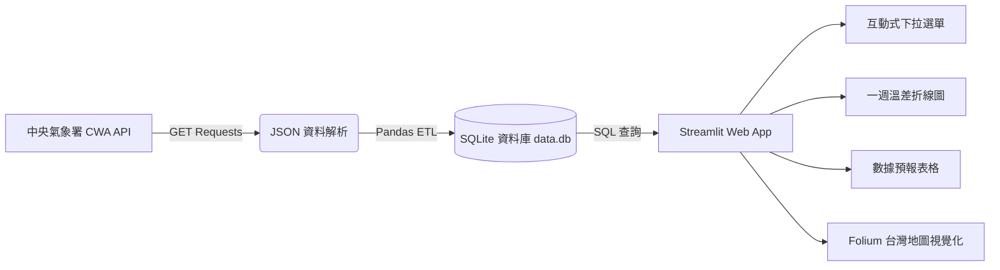

# 🌤️ Taiwan Weather Forecast - 台灣互動式天氣預報與視覺化儀表板

> **從氣象資料到互動式天氣預報應用**  
> *「用程式探索天氣，用資料看見台灣，用 AI 實現更多可能」*


---

## 📖 專案簡介 (Project Overview)

本專案源自 **AI 創新微課程《Taiwan Weather Forecast》**，旨在透過 Python 與中央氣象署（CWA）開放資料平台 API，串接台灣天氣預報資料，經過清洗、結構化與 SQLite 資料庫持久化，最後利用 Streamlit 與 Folium 打造出視覺化、具互動性的台灣即時天氣預報儀表板。

---

## ✨ 核心特色與功能 (Key Features)

1. **📡 CWA API 氣象資料自動取得**
   - 透過 `requests` 串接中央氣象署開放資料平台（Open Data API）。
   - 採用 HTTP Headers 進行 API Key 授權驗證，抓取最新一週氣象 JSON 資料。

2. **🧹 JSON 資料解析與 Pandas 資料清洗**
   - 深度解析巢狀 JSON 階層（`locations` ➔ `weatherElement` ➔ `MinT` / `MaxT`）。
   - 提取並重構全台各分區（北部、中部、南部、東部等）的最高溫與最低溫數據。
   - 利用 `Pandas DataFrame` 進行資料型態轉換與預覽檢查。

3. **💾 SQLite 本地資料庫儲存與管理**
   - 設計標準化關聯式資料表 `TemperatureForecasts`。
   - 支援資料寫入防重（避免重複執行腳本時資料膨脹）。
   - 支援原生 SQL 語法進行快速篩選與驗證。

4. **📊 Streamlit 互動式 Web 預報儀表板**
   - **分區切換**：下拉式選單即時篩選特定區域（北部、中部、南部、東北部、東南部等）。
   - **溫差趨勢圖**：繪製一週最高溫與最低溫雙折線圖，掌握未來溫度起伏。
   - **詳細資料表**：結構化清單呈現每日最高溫、最低溫明細。

5. **🗺️ Folium 台灣地理空間地圖視覺化**
   - 整合 `folium` 與 `streamlit-folium`，於互動地圖上標註各區氣候點位。
   - **溫度階層色彩**：依據平均氣溫自動標註不同警示色標（<20°C 藍、20~25°C 綠、25~30°C 橙、>30°C 紅）。
   - **日期選擇器**：選擇特定日期，動態展示當天全台各區氣溫分布與氣泡 Popup。

6. **🛡️ 模組化與高品質程式架構**
   - 包含錯誤例外處理（Try-Except）與 API 狀態碼檢驗。
   - 模組化設計（API 擷取模組、DB 儲存模組、前端視覺化模組分離）。

---

## 🏗️ 系統架構與資料流程 (System Architecture)



---

## 🗄️ 資料庫架構 (Database Schema)

資料庫採用 SQLite (`data.db`)，資料表定義如下：

### 表名稱：`TemperatureForecasts`

| 欄位名稱 | 型態 | 說明 |
| :--- | :--- | :--- |
| `id` | `INTEGER` | 主鍵，自動遞增 (PRIMARY KEY AUTOINCREMENT) |
| `regionName` | `TEXT` | 地區名稱（如：北部地區、中部地區、南部地區） |
| `dataDate` | `TEXT` | 預報日期（格式：`YYYY-MM-DD`） |
| `minT` | `REAL` | 最低氣溫（°C） |
| `maxT` | `REAL` | 最高氣溫（°C） |

---

## 🛠️ 技術棧 (Tech Stack)

| 領域 | 使用技術 / 套件 | 說明 |
| :--- | :--- | :--- |
| **程式語言** | `Python 3.10+` | 核心開發語言 |
| **網路連線** | `requests` | 串接 CWA Open Data REST API |
| **資料處理** | `pandas` | 結構化資料整理與清洗 |
| **資料儲存** | `sqlite3` | 輕量化本地關聯式資料庫 |
| **網頁框架** | `Streamlit` | 快速建構互動式 Web App 儀表板 |
| **圖表視覺化** | `Altair` / `Plotly` / `Matplotlib` | 繪製一週氣溫預測折線圖 |
| **地圖視覺化** | `folium`, `streamlit-folium` | 台灣地圖標記、色標分類與彈窗資訊 |
| **版本控管** | `Git` & `GitHub` | 程式碼版本維護與發布 |

---

## 🚀 快速開始 (Getting Started)

### 1. 複製專案庫 (Clone Repository)

```bash
git clone https://github.com/<your-username>/<your-repo-name>.git
cd AIot_L3_CWA_HW1
```

### 2. 建立虛擬環境與安裝相依套件

```bash
# 建立虛擬環境 (可選)
python -m venv venv

# 啟動虛擬環境 (Windows)
.\venv\Scripts\activate

# 啟動虛擬環境 (macOS/Linux)
source venv/bin/activate

# 安裝所需套件
pip install -r requirements.txt
```

> **`requirements.txt` 建議清單：**
> ```text
> requests
> pandas
> streamlit
> folium
> streamlit-folium
> ```

### 3. 設定中央氣象署 API 金鑰

1. 前往 [中央氣象署開放資料平台 (CWA Open Data)](https://opendata.cwa.gov.tw/) 註冊會員並申請授權碼（API Key）。
2. 在程式或環境變數中設定您的 `CWA_API_KEY`。

### 4. 執行爬蟲與資料入庫

```bash
# 擷取氣象局資料並寫入 SQLite 資料庫 (data.db)
python fetch_cwa_data.py
```

### 5. 啟動 Streamlit 儀表板

```bash
streamlit run app.py
```
啟動後，瀏覽器將自動開啟 `http://localhost:8501`。

---

## 📂 專案檔案結構 (Project Structure)

```plaintext
AIot_L3_CWA_HW1/
│
├── data/
│   └── data.db                 # SQLite 氣候歷史與預報資料庫
├── src/
│   ├── fetch_cwa_data.py       # 氣象局 API 資料爬取與 ETL 處理
│   ├── db_manager.py           # SQLite 連線、建表與查詢邏輯
│   └── map_visualizer.py       # Folium 台灣地圖繪製與溫階色標邏輯
├── app.py                      # Streamlit 前端儀表板主入口
├── requirements.txt            # 相依套件清單
└── README.md                   # 專案說明文件
```

---

## 💡 未來延伸應用 (Future Roadmap)

- [ ] **LINE Bot 天氣小秘書**：每日早晨主動推播氣溫、紫外線與降雨提醒。
- [ ] **智慧旅遊行程建議**：串接景點資料庫，依照各地天氣動態推薦出遊地點。
- [ ] **農業與防災預警系統**：針對極端低溫（寒流）或連續高溫發出農作物防寒防曬警告。
- [ ] **整合 LLM / AI 智慧分析**：結合大型語言模型，自動生成通俗幽默的「今日穿搭建議」與氣象總結。

---

## 👨‍🏫 課程致謝 (Acknowledgments)

- **課程名稱**：AI 創新微課程 - Taiwan Weather Forecast
- **指導講師**：煥哥
- **名言啟發**：
  > *「技術可以解決問題，但更重要的是用技術創造更好的未來！」*