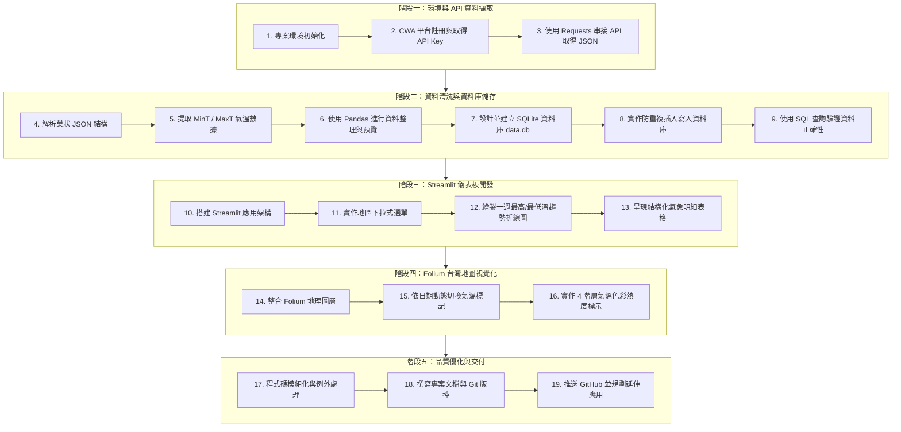

# 📋 Taiwan Weather Forecast 實作工作流程 (Workflow)

本工作流程依據 **AI 創新微課程《Taiwan Weather Forecast》** 的 24 個學習步驟制定，涵蓋從氣象 API 資料取得、資料庫儲存、資料視覺化到 GitHub 部署的完整生命週期。

---

## 🗺️ 流程總覽 (Process Overview)

---

## 📌 詳細執行步驟 (Detailed Steps)

### 階段一：環境與 API 資料擷取
- [x] **步驟 1：建立專案與相依環境**
  - 建立虛擬環境：`python -m venv venv`
  - 安裝必要套件：`requests`, `pandas`, `streamlit`, `folium`, `streamlit-folium`。
- [x] **步驟 2：中央氣象署 CWA 平台註冊**
  - 前往 CWA 開放資料平台註冊會員，取得個人 `Authorization` API Key。
- [x] **步驟 3：使用 Requests 抓取氣象資料**
  - 撰寫 `fetch_cwa_data.py`，發送 HTTP GET 請求取得未來一週全台分區天氣預報 JSON 資料。

---

### 階段二：資料清洗與 SQLite 資料庫建構
- [x] **步驟 4：解析 JSON 階層結構**
  - 探索 JSON 內的 `records` ➔ `locations` ➔ `location` ➔ `weatherElement` 結構。
- [x] **步驟 5：提取最高溫 (MaxT) 與最低溫 (MinT)**
  - 解析時間戳記、地區名稱與高低溫數值。
- [x] **步驟 6：Pandas 整理結構化資料**
  - 轉為 Pandas DataFrame，統一欄位命名與型態轉換。
- [x] **步驟 7：建立 SQLite 資料表 `TemperatureForecasts`**
  - 定義欄位：`id`, `regionName`, `dataDate`, `minT`, `maxT`。
- [x] **步驟 8：資料寫入與防重複機制**
  - 實作寫入邏輯，重複執行時進行覆蓋或略過，保持資料乾淨。
- [x] **步驟 9：SQL 查詢驗證**
  - 執行 `SELECT DISTINCT regionName` 與條件查詢檢視資料。

---

### 階段三：Streamlit 互動式儀表板開發
- [x] **步驟 10：建立 Streamlit 主應用 `app.py`**
  - 設定頁面標題、圖示與佈局配置（Wide mode）。
- [x] **步驟 11：實作側邊欄/下拉式選單**
  - 提供北部、中部、南部、東北部、東南部、外島等分區篩選。
- [x] **步驟 12：繪製氣溫折線圖**
  - 繪製最高溫（紅色線）與最低溫（藍色線）對比圖。
- [x] **步驟 13：資料表格呈現**
  - 使用 `st.dataframe` 清楚展示一週詳細預測數據。

---

### 階段四：Folium 台灣地圖視覺化
- [x] **步驟 14：整合 Folium 地圖組件**
  - 載入台灣地理中心座標，設定合適縮放比例（Zoom Level）。
- [x] **步驟 15：動態日期選擇**
  - 加入日期篩選器，選擇特定日期後更新地圖標註點。
- [x] **步驟 16：溫度四色標記與彈窗**
  - `<20°C`：藍色（涼爽 / 寒冷）
  - `20~25°C`：綠色（舒適）
  - `25~30°C`：橙色（暖熱）
  - `>30°C`：紅色（炎熱）
  - 點擊標記顯示氣泡彈窗（Popup）呈現該區精確氣溫。

---

### 階段五：程式碼品質優化與交付
- [x] **步驟 17：模組化重構與例外處理**
  - 封裝 `fetch_cwa_data.py`、`db_manager.py`、`map_visualizer.py`。
  - 加入 Network Error、API Key 過期、資料庫連線失敗等防禦性程式碼。
- [x] **步驟 18：更新專案文檔與說明文件**
  - 完善 `README.md`、`workflow.md`、`design.md`。
- [ ] **步驟 19：Git 版本控制與發布**
  - 規範 Commit 訊息，推送到 GitHub 儲存庫進行保存與作品集展示。
